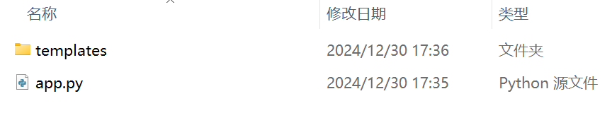
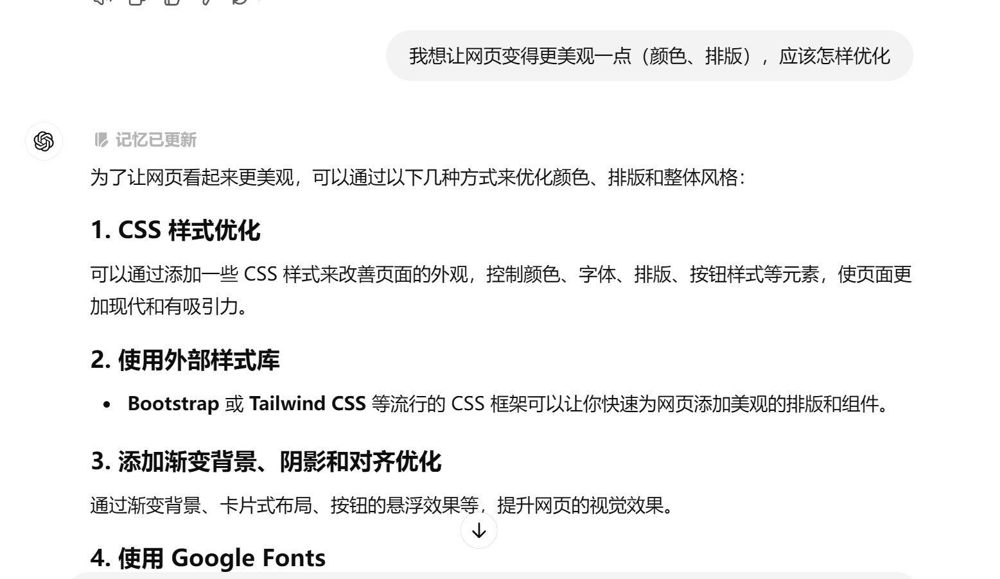
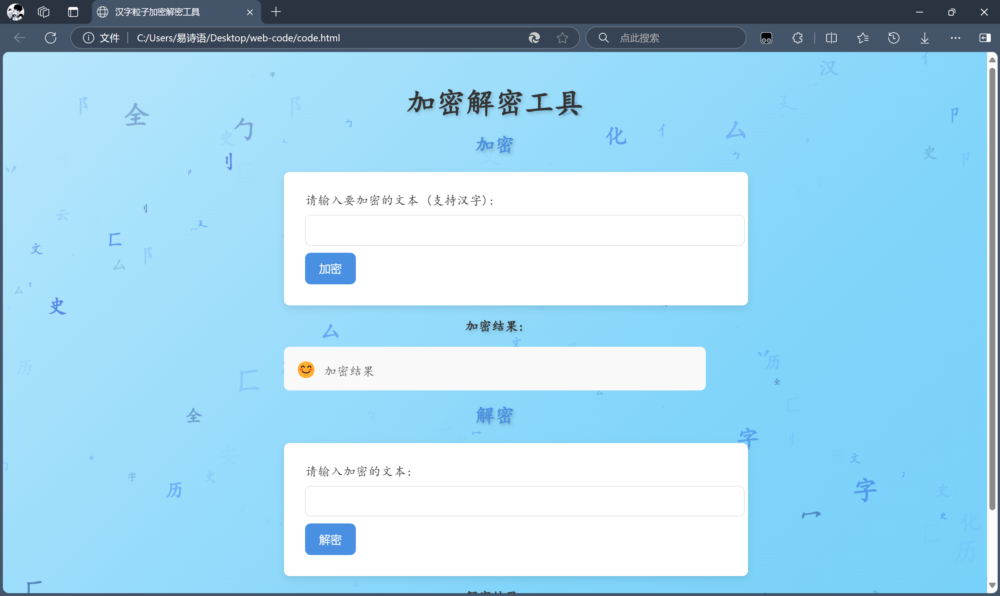
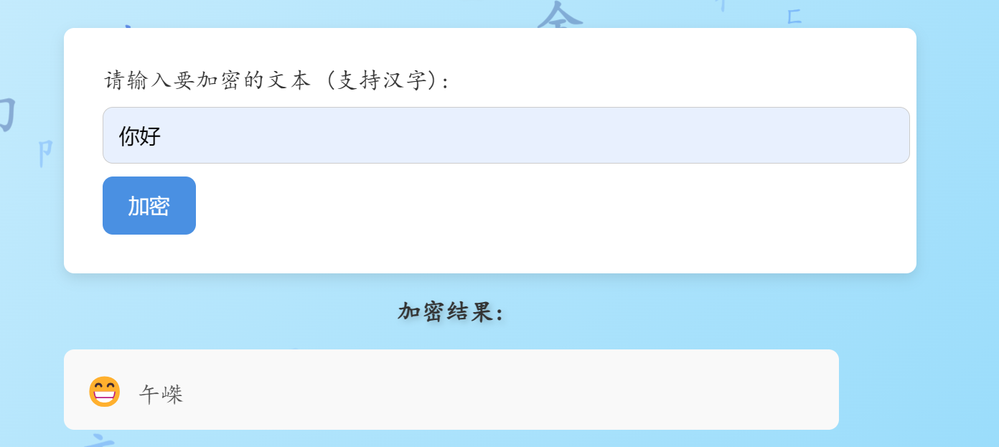
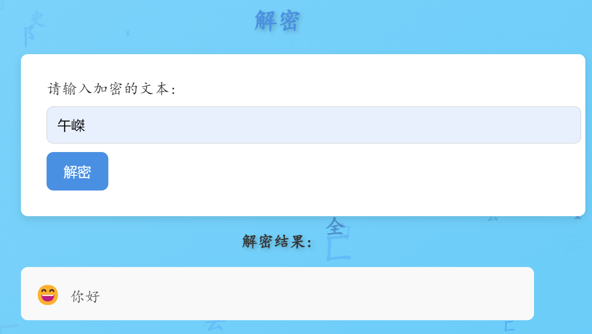

# 汉字与历史文化结课作业

**汉字加解密-web前端技术**

**写在最前面：最终效果呈现网址如下：**

**https://yokusam.github.io/my-encryption-webpage/**

（PDF格式下点击也可直接跳转）

我的专业是网络空间安全，下学期即将迎来一门很难的密码学的课程，这让我非常头疼。在思考创意作业时，我抬头第一眼看到的就是书架上的密码学书籍，于是想到了利用汉字作为密码表，实现加解密。另外为了更直观的显示加解密程序，我选择利用用web前端技术，用一个网页的形式呈现。临近期末，目前的代码还不是很成熟，但也能基本实现我的需求，能够作为一份期末作业呈现上来。

**由于需要展示一点代码，为实现美观性，本篇结课作业报告是使用 `markdown` 编写的一个md文件，会转为PDF形式方便查看。**


## 1.创意设计的灵感来源
这个设计的灵感来源于古代汉字的文化传承与密码学的创新结合。汉字作为世界上最古老的文字体系之一，不仅是中华文明的重要载体，也蕴含了深厚的历史与文化内涵。从甲骨文到篆书再到现代汉字，汉字的形态随着时代的发展不断演变，展现了中华民族的智慧与创造力。而现代密码学以信息安全为核心，其对信息加密和解密的技术需求，与古代汉字的多样性和复杂性不谋而合。因此，我的创意设计以汉字为核心，将现代加密算法与古文字文化相结合，探索传统文化在信息技术领域中的应用价值。

汉字自古以来具有符号性与象征性，这些特质在古代已经被用于一些“加密”功能，例如春秋战国时期的“文字谜”、官吏之间的机密通信等。甲骨文、金文、篆书等早期汉字，因其复杂的结构和变化多端的笔画，天然具有隐秘性。但是由于能查找到的相关资料较为有限，并出于代码编写难度以及版权考虑，本次设计采用的密码表并没能采用古汉字，选择的是融入现代汉字，通过将汉字融入现代密码加密与解密的过程，在信息交流中体验到文化与技术的双重乐趣。


## 2.尝试一：flask

我的web前端技术其实比较有限，最开始的尝试是基于flask完成我的网页制作。我首先使用python语言编写了加解密的代码，由于一开始我是想基于flask来实现网页，甚至代码都写好了（如下图所示），基本调试好了之后发现一个问题，就是平常大家的电脑都不会装flask，没有它的支持的话是进不去该网页的，所以放弃了这一形式，在这一版的基础上进行改良。



*(初版，包含一个 python文件和 templates 文件夹，文件夹内为一个HTML文件)*

- 初版加解密代码（python语言）：

```python

from flask import Flask, render_template, request, jsonify
from Crypto.Cipher import AES
from Crypto.Util.Padding import pad, unpad
import base64
import os

app = Flask(__name__)

# AES加密
def encrypt_message(message, key):
    cipher = AES.new(key, AES.MODE_CBC)  # CBC模式
    ct_bytes = cipher.encrypt(pad(message.encode(), AES.block_size))  # 填充数据并加密
    iv = base64.b64encode(cipher.iv).decode('utf-8')  # 初始化向量
    ct = base64.b64encode(ct_bytes).decode('utf-8')  # 密文
    return iv, ct

# AES解密
def decrypt_message(iv, ct, key):
    iv = base64.b64decode(iv)
    ct = base64.b64decode(ct)
    cipher = AES.new(key, AES.MODE_CBC, iv=iv)
    pt = unpad(cipher.decrypt(ct), AES.block_size).decode('utf-8')
    return pt

@app.route('/')
def index():
    return render_template('index.html')

@app.route('/encrypt', methods=['POST'])
def encrypt():
    message = request.form['message']
    key = os.urandom(16)  # 随机生成16字节的密钥
    iv, encrypted_message = encrypt_message(message, key)
    return jsonify({'iv': iv, 'encrypted': encrypted_message})

@app.route('/decrypt', methods=['POST'])
def decrypt():
    iv = request.form['iv']
    encrypted_message = request.form['message']
    key = os.urandom(16)  # 这里需要使用和加密时一样的密钥
    decrypted_message = decrypt_message(iv, encrypted_message, key)
    return jsonify({'decrypted': decrypted_message})

if __name__ == '__main__':
    app.run(debug=True)

```

## 3.尝试二：直接使用 JavaScript 

我希望实现一个不需要 Flask 或任何后端支持的加密解密工具，只通过一个纯前端的网页来实现，于是尝试直接使用 JavaScript 来进行加密解密操作。这样，只需一个简单的 HTML 文件即可，不再需要 Flask 或 Python 的支持。

我首先编写了基本代码，实现我想要的加解密基本操作，然后利用 chatgpt 帮我优化网页页面，使用的语句如下：



chatgpt给出了几种优化方案，我采取了一种应用到我的代码上，最终代码我会放在最后。
> **优化点**：
>  - 字体：使用了 Google Fonts 的 Noto Sans SC 字体，专门为中文优化的字体，界面看起来更加现代和清晰。
>  - 页面背景：使用了渐变背景色（从浅灰到白色），使页面看起来更加柔和。
>  - 卡片式布局：表单和结果部分使用了 box-shadow 和 border-radius，为卡片加上阴影，使其看起来更加立体和现代。
>  - 按钮样式：按钮采用了蓝色背景，并且添加了悬浮效果，鼠标悬停时颜色会变化，提升了交互感。
>  - 结果区域：加密和解密的结果区域加入了背景色、内边距和圆角，呈现出更清爽的界面。
>  - 渐变背景：添加了渐变背景效果，并使其具有动画效果，这样页面的背景色会随着时间变化。
>  - 响应式布局：页面设计自动适配不同的设备屏幕，确保小屏幕设备（如手机）上显示正常。

另外在最终调整收尾时加上了一点汉字粒子悬浮效果，让背景不太空。
为了趣味性和美观，顺便加了一点交互效果，鼠标悬停时汉字粒子会反向，鼠标点击时生成更多汉字粒子。

## 4.网页展示

点击链接，得到如下网页：



可以进行简单的加解密运算：

- **加密**：示例：加密“你好”，得到两个汉字加密字符



- **解密**：示例：对上面的加密字符进行解密




## 5.解释说明

我已经将网页文件上传到我的github上，并使用 `GitHub Pages` 部署，现在已经能够通过网址直接访问。
网页链接如下（和开头的展示链接相同）：

https://yokusam.github.io/my-encryption-webpage/

（由于不同型号手机的兼容性不同，因此在手机端页面比例等可能会存在一定拉伸，网页端应该大体没有什么问题。）

感谢观看！

另外在最后也把最终调整完后使用的代码放一下：

```html

<!DOCTYPE html>
<html lang="zh">
<head>
    <meta charset="UTF-8">
    <meta name="viewport" content="width=device-width, initial-scale=1.0">
    <title>汉字粒子加密解密工具</title>

    <!-- 引入 Google Fonts -->
    <link href="https://fonts.googleapis.com/css2?family=KaiTi&family=Noto+Sans+SC:wght@300;400;500;700&display=swap" rel="stylesheet">
    
    <!-- 引入 tsparticles -->
    <script src="https://cdn.jsdelivr.net/npm/tsparticles@1.38.0/tsparticles.min.js"></script>

    <!-- 自定义 CSS 样式 -->
    <style>
        body {
            font-family: 'KaiTi', 'Noto Sans SC', sans-serif;
            margin: 0;
            padding: 0;
            display: flex;
            justify-content: center;
            align-items: center;
            min-height: 100vh;
            background: linear-gradient(135deg, #ffffff, #81d4fa, #4fc3f7);
            background-size: 300% 300%;
            animation: gradientAnimation 3s ease infinite;
        }

        #particles-js {
            position: absolute;
            top: 0;
            left: 0;
            width: 100%;
            height: 100vh; /* 使用视口高度 */
            z-index: -1;
        }

        @keyframes gradientAnimation {
            0% { background-position: 0% 50%; }
            50% { background-position: 100% 50%; }
            100% { background-position: 0% 50%; }
        }

        h1, h2, h3 {
            color: #333;
            text-align: center;
            text-shadow: 2px 2px 5px rgba(0, 0, 0, 0.2); /* 增加阴影效果 */
        }

        h1 {
            font-size: 42px;
            margin-bottom: 20px;
        }

        h2 {
            font-size: 28px;
            color: #4A90E2;
            margin-top: 20px;
        }

        label {
            font-size: 18px;
            color: #333;
        }

        input[type="text"] {
            width: 100%;
            padding: 12px;
            margin: 10px 0;
            border-radius: 8px;
            border: 1px solid #ccc;
            font-size: 16px;
        }

        button {
            background-color: #4A90E2;
            color: white;
            padding: 12px 20px;
            border: none;
            border-radius: 8px;
            font-size: 16px;
            cursor: pointer;
            transition: background-color 0.3s ease;
        }

        button:hover {
            background-color: #357ABD;
        }

        form {
            width: 100%;
            max-width: 600px;
            background-color: white;
            padding: 30px;
            border-radius: 8px;
            box-shadow: 0 4px 10px rgba(0, 0, 0, 0.1);
        }

        .result {
            font-size: 18px;
            color: #555;
            background: #f9f9f9;
            padding: 15px;
            border-radius: 8px;
            margin-top: 15px;
        }

        .result p {
            margin: 0;
        }

        .container {
            width: 100%;
            max-width: 600px;
            padding: 20px;
        }

        .emoji {
            font-size: 24px;
        }
    </style>
</head>
<body>
    <div id="particles-js"></div>

    <div class="container">
        <h1>加密解密工具</h1>

        <!-- 加密部分 -->
        <h2>加密</h2>
        <form id="encrypt-form">
            <label for="encrypt-message">请输入要加密的文本 (支持汉字):</label>
            <input type="text" id="encrypt-message" name="message">
            <button type="submit">加密</button>
        </form>
        <h3>加密结果:</h3>
        <div class="result" id="encrypted-result">
            <span class="emoji">😊</span> <span id="encrypt-message-result">加密结果</span>
        </div>

        <!-- 解密部分 -->
        <h2>解密</h2>
        <form id="decrypt-form">
            <label for="decrypt-message">请输入加密的文本:</label>
            <input type="text" id="decrypt-message" name="message">
            <button type="submit">解密</button>
        </form>
        <h3>解密结果:</h3>
        <div class="result" id="decrypted-result">
            <span class="emoji">😜</span> <span id="decrypt-message-result">解密结果</span>
        </div>
    </div>

    <script>
        // 初始化粒子背景
        tsParticles.load("particles-js", {
            particles: {
                number: {
                    value: 100, // 粒子数量
                    density: {
                        enable: true,
                        value_area: 800
                    }
                },
                shape: {
                    type: "char", // 将粒子形状改为字符
                    character: {
                        value: ["汉", "字", "云", "安", "全","历","史","文","化",
                        "讠","刂","亻","廴","勹","冫","匚","卩","阝","丷","冖","厶"], 
                        // 替换成想要的汉字
                        font: "KaiTi", // 使用字体
                        style: "",
                        weight: "bold" // 字重
                    }
                },
                size: {
                    value: 20, // 汉字大小
                    random: true // 随机大小
                },
                opacity: {
                    value: 0.8, // 汉字透明度
                    random: true
                },
                color: {
                    value: ["#1e3a8a", "#3b82f6", "#2563eb", "#1d4ed8"] // 蓝色系
                },
                move: {
                    enable: true,
                    speed: 3, // 运动速度
                    direction: "none", // 运动方向
                    random: true,
                    straight: false,
                    out_mode: "out", // 移出屏幕后重新出现
                    bounce: false
                }
            },
            interactivity: {
                events: {
                    onhover: {
                        enable: true,
                        mode: "repulse" // 鼠标悬停时粒子会反向
                    },
                    onclick: {
                        enable: true,
                        mode: "push" // 鼠标点击时生成更多粒子
                    }
                }
            }
        });

        // 加密和解密的偏移量（可以调整这个数值来改变加密效果）
        const OFFSET = 1000;

        // 加密函数
        function encryptMessage(text) {
            return text.split('').map(char => {
                let unicode = char.charCodeAt(0);  // 获取字符的 Unicode 编码
                return String.fromCharCode(unicode + OFFSET);  // 偏移并转换为新的字符
            }).join('');
        }

        // 解密函数
        function decryptMessage(encryptedText) {
            return encryptedText.split('').map(char => {
                let unicode = char.charCodeAt(0);  // 获取字符的 Unicode 编码
                return String.fromCharCode(unicode - OFFSET);  // 恢复原字符
            }).join('');
        }

        // 加密表单提交
        document.getElementById('encrypt-form').addEventListener('submit', function (event) {
            event.preventDefault();
            let message = document.getElementById('encrypt-message').value;
            let encryptedMessage = encryptMessage(message);
            document.getElementById('encrypted-result').innerHTML = `<span class="emoji">😁</span> ${encryptedMessage}`;
        });

        // 解密表单提交
        document.getElementById('decrypt-form').addEventListener('submit', function (event) {
            event.preventDefault();
            let encryptedMessage = document.getElementById('decrypt-message').value;
            let decryptedMessage = decryptMessage(encryptedMessage);
            document.getElementById('decrypted-result').innerHTML = `<span class="emoji">😄</span> ${decryptedMessage}`;
        });
    </script>
</body>
</html>
```
